# Database Schema Documentation
## Academic Research Platform - Multi-Tool Database Architecture

**Version:** 1.0
**Date:** November 4, 2025
**Database:** PostgreSQL 14+
**ORM:** SQLAlchemy 2.0

---

## Table of Contents

1. [Overview](#overview)
2. [Entity Relationship Diagram](#entity-relationship-diagram)
3. [Core Tables](#core-tables)
4. [Shared Tables](#shared-tables)
5. [Tool-Specific Tables](#tool-specific-tables)
6. [Association Tables](#association-tables)
7. [Indexes and Performance](#indexes-and-performance)
8. [Query Patterns](#query-patterns)
9. [Migration Strategy](#migration-strategy)

---

## Overview

The database schema supports a 4-tool academic research platform:

1. **Tool 1: Meta-Analysis Assistant** - Systematic reviews and meta-analysis
2. **Tool 2: Research Direction Generator** - Gap analysis and proposal generation
3. **Tool 3: Peer Review Assistant** - Manuscript screening and review generation
4. **Tool 4: Expert Reviewer Matcher** - AI-powered reviewer matching

### Design Principles

- **Normalization**: 3NF for core data, denormalized JSON for flexibility
- **UUID Primary Keys**: All tables use UUIDs for distributed system compatibility
- **Soft Deletes**: `deleted_at` timestamp instead of hard deletes
- **Audit Trails**: `created_at`, `updated_at`, `created_by`, `updated_by` on all tables
- **JSONB Fields**: Flexible storage for tool-specific metadata
- **PostgreSQL Features**: Full-text search, array types, JSONB indexing

---

## Entity Relationship Diagram

```mermaid
erDiagram
    USERS ||--o{ PROJECTS : owns
    USERS ||--o{ API_KEYS : has
    USERS ||--o{ MANUSCRIPTS : submits

    PROJECTS ||--o{ WORKFLOWS : contains
    PROJECTS }o--o{ PAPERS : analyzes
    PROJECTS }o--o{ RESEARCHERS : involves

    WORKFLOWS ||--|| PROJECTS : belongs_to

    PAPERS }o--o{ RESEARCHERS : authored_by
    PAPERS }o--o{ PROJECTS : included_in

    RESEARCHERS }o--o{ PAPERS : authored
    RESEARCHERS }o--o{ PROJECTS : participates_in
    RESEARCHERS ||--o{ PEER_REVIEWS : writes
    RESEARCHERS ||--o{ REVIEWER_MATCHES : matched_to

    MANUSCRIPTS ||--o{ PEER_REVIEWS : receives
    MANUSCRIPTS ||--o{ REVIEWER_MATCHES : has
    MANUSCRIPTS }o--|| USERS : submitted_by

    PEER_REVIEWS }o--|| MANUSCRIPTS : reviews
    PEER_REVIEWS }o--|| RESEARCHERS : written_by

    REVIEWER_MATCHES }o--|| MANUSCRIPTS : matches
    REVIEWER_MATCHES }o--|| RESEARCHERS : recommends

    RESEARCH_GAPS }o--|| PROJECTS : identified_in
    RESEARCH_GAPS ||--o{ RESEARCH_PROPOSALS : addresses

    RESEARCH_PROPOSALS }o--|| PROJECTS : belongs_to
    RESEARCH_PROPOSALS }o--|| RESEARCH_GAPS : addresses

    USERS {
        uuid id PK
        string email UK
        string hashed_password
        string name
        string institution
        string role
        boolean is_active
        boolean is_verified
        string orcid UK
        timestamp created_at
        timestamp updated_at
        timestamp deleted_at
    }

    PROJECTS {
        uuid id PK
        uuid user_id FK
        string tool_type
        string title
        text description
        string status
        jsonb config
        jsonb findings
        jsonb metadata
        timestamp created_at
        timestamp updated_at
    }

    WORKFLOWS {
        uuid id PK
        uuid project_id FK
        string agent_name
        string agent_role
        jsonb input_data
        jsonb output_data
        jsonb decisions
        string status
        float duration_seconds
        float confidence_score
        timestamp created_at
    }

    PAPERS {
        uuid id PK
        text title
        text abstract
        array authors
        string journal
        integer year
        string doi UK
        string pmid UK
        string arxiv_id UK
        array keywords
        string credibility_level
        float effect_size
        integer sample_size
        jsonb extracted_statistics
        timestamp created_at
    }

    RESEARCHERS {
        uuid id PK
        string orcid UK
        string name
        string email
        string institution
        integer h_index
        integer publication_count
        array expertise_keywords
        jsonb expertise_domains
        integer recent_review_count
        float average_review_time_days
        timestamp created_at
    }

    MANUSCRIPTS {
        uuid id PK
        text title
        text abstract
        array keywords
        string manuscript_type
        uuid corresponding_author_id FK
        string status
        integer current_round
        float quality_score
        string editorial_decision
        timestamp submission_date
        timestamp created_at
    }

    PEER_REVIEWS {
        uuid id PK
        uuid manuscript_id FK
        uuid reviewer_id FK
        integer review_round
        text review_text
        text strengths
        text weaknesses
        float overall_score
        string recommendation
        boolean ai_assisted
        timestamp created_at
    }

    REVIEWER_MATCHES {
        uuid id PK
        uuid manuscript_id FK
        uuid researcher_id FK
        float expertise_score
        float availability_score
        float overall_score
        float conflict_risk
        boolean has_conflict
        array matching_keywords
        string status
        timestamp created_at
    }

    RESEARCH_GAPS {
        uuid id PK
        uuid project_id FK
        string title
        text description
        string gap_type
        float impact_potential
        float feasibility_score
        string priority
        array evidence
        timestamp created_at
    }

    RESEARCH_PROPOSALS {
        uuid id PK
        uuid project_id FK
        uuid gap_id FK
        text title
        text research_question
        text methodology
        text expected_impact
        float novelty_score
        float feasibility_score
        string status
        boolean ai_generated
        timestamp created_at
    }
```



---

## Core Tables

### users
**Purpose**: User authentication and authorization
**Used by**: All tools

| Column | Type | Constraints | Description |
|--------|------|-------------|-------------|
| id | UUID | PK | Primary key |
| email | VARCHAR(255) | UNIQUE, NOT NULL | User email address |
| hashed_password | VARCHAR(255) | NOT NULL | Bcrypt hashed password |
| name | VARCHAR(255) | | Full name |
| institution | VARCHAR(255) | | Academic institution |
| role | VARCHAR(50) | NOT NULL | Role: researcher, editor, admin, reviewer |
| is_active | BOOLEAN | DEFAULT TRUE | Account status |
| is_verified | BOOLEAN | DEFAULT FALSE | Email verification status |
| orcid | VARCHAR(50) | UNIQUE | ORCID identifier |
| created_at | TIMESTAMP | NOT NULL | Account creation |
| updated_at | TIMESTAMP | NOT NULL | Last update |
| deleted_at | TIMESTAMP | | Soft delete timestamp |

**Indexes**:
- `idx_users_email` on `email` (UNIQUE)
- `idx_users_orcid` on `orcid` (UNIQUE, PARTIAL WHERE orcid IS NOT NULL)
- `idx_users_institution` on `institution`
- `idx_users_deleted_at` on `deleted_at` (PARTIAL WHERE deleted_at IS NULL)

---

### projects
**Purpose**: Universal container for all tool workflows
**Used by**: All tools

| Column | Type | Constraints | Description |
|--------|------|-------------|-------------|
| id | UUID | PK | Primary key |
| user_id | UUID | FK → users.id, NOT NULL | Project owner |
| tool_type | VARCHAR(50) | NOT NULL | meta_analysis, research_direction, peer_review, reviewer_matcher |
| title | VARCHAR(500) | NOT NULL | Project title |
| description | TEXT | | Project description |
| status | VARCHAR(50) | NOT NULL | draft, in_progress, completed, failed, archived |
| config | JSONB | | Tool-specific configuration |
| findings | JSONB | | Results and findings |
| metadata | JSONB | | Additional metadata |
| created_at | TIMESTAMP | NOT NULL | Creation timestamp |
| updated_at | TIMESTAMP | NOT NULL | Last update timestamp |
| deleted_at | TIMESTAMP | | Soft delete |

**Indexes**:
- `idx_projects_user_id` on `user_id`
- `idx_projects_tool_type` on `tool_type`
- `idx_projects_status` on `status`
- `idx_projects_config_gin` on `config` (GIN for JSONB queries)
- `idx_projects_title_gin` on `title` (GIN for full-text search)

**Check Constraints**:
- `tool_type IN ('meta_analysis', 'research_direction', 'peer_review', 'reviewer_matcher')`
- `status IN ('draft', 'in_progress', 'completed', 'failed', 'archived')`

---

### workflows
**Purpose**: Track agent execution and decisions
**Used by**: All tools (agent orchestration)

| Column | Type | Constraints | Description |
|--------|------|-------------|-------------|
| id | UUID | PK | Primary key |
| project_id | UUID | FK → projects.id, NOT NULL | Parent project |
| agent_name | VARCHAR(255) | NOT NULL | Agent class name |
| agent_role | VARCHAR(50) | NOT NULL | Agent role (coordinator, search, etc.) |
| input_data | JSONB | | Agent input parameters |
| output_data | JSONB | | Agent output results |
| decisions | JSONB | | Array of agent decisions with reasoning |
| status | VARCHAR(50) | NOT NULL | created, queued, in_progress, completed, failed, cancelled |
| error_message | TEXT | | Error details if failed |
| retry_count | INTEGER | DEFAULT 0 | Number of retry attempts |
| started_at | TIMESTAMP | | Execution start time |
| completed_at | TIMESTAMP | | Execution end time |
| duration_seconds | FLOAT | | Execution duration |
| confidence_score | FLOAT | | Agent confidence (0.0-1.0) |
| quality_score | FLOAT | | Output quality score (0.0-1.0) |
| created_at | TIMESTAMP | NOT NULL | Record creation |
| updated_at | TIMESTAMP | NOT NULL | Last update |

**Indexes**:
- `idx_workflows_project_id` on `project_id`
- `idx_workflows_agent_name` on `agent_name`
- `idx_workflows_agent_role` on `agent_role`
- `idx_workflows_status` on `status`
- `idx_workflows_decisions_gin` on `decisions` (GIN for decision search)

---

## Shared Tables

### papers
**Purpose**: Academic papers/studies
**Used by**: Tools 1 (meta-analysis), 2 (research direction), 3 (peer review)

| Column | Type | Constraints | Description |
|--------|------|-------------|-------------|
| id | UUID | PK | Primary key |
| title | TEXT | NOT NULL | Paper title |
| abstract | TEXT | | Abstract text |
| authors | TEXT[] | | Array of author names |
| journal | VARCHAR(255) | | Journal name |
| year | INTEGER | | Publication year |
| doi | VARCHAR(255) | UNIQUE | Digital Object Identifier |
| pmid | VARCHAR(50) | UNIQUE | PubMed ID |
| arxiv_id | VARCHAR(50) | UNIQUE | arXiv ID |
| pmc_id | VARCHAR(50) | UNIQUE | PubMed Central ID |
| keywords | TEXT[] | | Keywords array |
| mesh_terms | TEXT[] | | Medical Subject Headings |
| database_source | VARCHAR(50) | | pubmed, arxiv, europe_pmc, core, etc. |

**Tool 1 (Meta-Analysis) Fields**:
| Column | Type | Description |
|--------|------|-------------|
| credibility_level | VARCHAR(50) | very_low, low, medium, high |
| credibility_score | FLOAT | Credibility score (0.0-1.0) |
| credibility_reasoning | TEXT | Explanation for credibility assessment |
| extracted_statistics | JSONB | Effect sizes, CIs, p-values, etc. |
| effect_size | FLOAT | Calculated effect size |
| effect_size_ci_lower | FLOAT | Lower confidence interval |
| effect_size_ci_upper | FLOAT | Upper confidence interval |
| sample_size | INTEGER | Study sample size |
| p_value | FLOAT | Statistical p-value |
| inclusion_status | VARCHAR(50) | included, excluded, screening |
| exclusion_reason | TEXT | Why excluded |

**Tool 2 (Research Direction) Fields**:
| Column | Type | Description |
|--------|------|-------------|
| research_gaps | TEXT[] | Identified research gaps |
| trending_topics | TEXT[] | Trending research topics |
| novelty_score | FLOAT | Novelty assessment (0.0-1.0) |

**Tool 3 (Peer Review) Fields**:
| Column | Type | Description |
|--------|------|-------------|
| review_quality_score | FLOAT | Quality of methodology (0.0-1.0) |
| methodology_score | FLOAT | Methodology assessment |
| clarity_score | FLOAT | Writing clarity score |

**Shared Fields**:
| Column | Type | Description |
|--------|------|-------------|
| citation_count | INTEGER | Number of citations |
| full_text_url | TEXT | URL to full text |
| pdf_path | TEXT | Local PDF storage path |
| pdf_hash | VARCHAR(64) | SHA256 hash for deduplication |
| full_text | TEXT | Extracted full text |
| metadata | JSONB | Additional metadata |
| created_at | TIMESTAMP | Record creation |
| updated_at | TIMESTAMP | Last update |
| deleted_at | TIMESTAMP | Soft delete |

**Indexes**:
- `idx_papers_doi` on `doi` (UNIQUE, PARTIAL)
- `idx_papers_pmid` on `pmid` (UNIQUE, PARTIAL)
- `idx_papers_arxiv_id` on `arxiv_id` (UNIQUE, PARTIAL)
- `idx_papers_year` on `year`
- `idx_papers_journal` on `journal`
- `idx_papers_credibility_level` on `credibility_level`
- `idx_papers_inclusion_status` on `inclusion_status`
- `idx_papers_pdf_hash` on `pdf_hash`
- `idx_papers_title_gin` on `title` (GIN trigram for fuzzy search)
- `idx_papers_full_text_gin` on `full_text` (GIN trigram for full-text search)
- `idx_papers_metadata_gin` on `metadata` (GIN for JSONB)

---

### researchers
**Purpose**: Researcher/expert profiles
**Used by**: Tools 2 (research direction), 4 (reviewer matching)

| Column | Type | Constraints | Description |
|--------|------|-------------|-------------|
| id | UUID | PK | Primary key |
| orcid | VARCHAR(50) | UNIQUE | ORCID identifier |
| name | VARCHAR(255) | NOT NULL | Researcher name |
| email | VARCHAR(255) | | Contact email |
| institution | VARCHAR(255) | | Current institution |
| department | VARCHAR(255) | | Department |
| country | VARCHAR(100) | | Country |
| website | TEXT | | Personal website |

**Academic Metrics**:
| Column | Type | Description |
|--------|------|-------------|
| h_index | INTEGER | Hirsch index |
| i10_index | INTEGER | i10 index |
| total_citations | INTEGER | Total citation count |
| publication_count | INTEGER | Number of publications |

**Tool 4 (Reviewer Matching) Fields**:
| Column | Type | Description |
|--------|------|-------------|
| expertise_keywords | TEXT[] | Expertise keywords |
| expertise_domains | JSONB | {domain: confidence_score} |
| research_domains | TEXT[] | Research domain names |
| recent_review_count | INTEGER | Reviews in last 12 months |
| total_review_count | INTEGER | Total reviews completed |
| average_review_time_days | FLOAT | Average review turnaround |
| last_review_date | DATE | Most recent review date |
| estimated_availability | FLOAT | Availability score (0.0-1.0) |
| current_workload | INTEGER | Current active reviews |
| response_rate | FLOAT | Response rate (0.0-1.0) |

**Tool 2 (Research Direction) Fields**:
| Column | Type | Description |
|--------|------|-------------|
| trending_areas | TEXT[] | Emerging research areas |
| emerging_expertise | JSONB | New expertise domains |

**Network Information**:
| Column | Type | Description |
|--------|------|-------------|
| coauthor_ids | UUID[] | Co-author researcher IDs |
| institution_collaborators | UUID[] | Same-institution researchers |
| last_active | DATE | Last publication/activity |
| last_publication_date | DATE | Most recent paper |

**External IDs**:
| Column | Type | Description |
|--------|------|-------------|
| semantic_scholar_id | VARCHAR(100) | Semantic Scholar ID |
| google_scholar_id | VARCHAR(100) | Google Scholar ID |

**Standard Fields**:
| Column | Type | Description |
|--------|------|-------------|
| metadata | JSONB | Additional data |
| created_at | TIMESTAMP | Record creation |
| updated_at | TIMESTAMP | Last update |
| deleted_at | TIMESTAMP | Soft delete |

**Indexes**:
- `idx_researchers_orcid` on `orcid` (UNIQUE)
- `idx_researchers_email` on `email`
- `idx_researchers_institution` on `institution`
- `idx_researchers_country` on `country`
- `idx_researchers_name_gin` on `name` (GIN trigram)
- `idx_researchers_semantic_scholar_id` on `semantic_scholar_id`

---

## Tool-Specific Tables

### Tool 3: Peer Review Assistant

#### manuscripts
**Purpose**: Manuscripts submitted for peer review

| Column | Type | Constraints | Description |
|--------|------|-------------|-------------|
| id | UUID | PK | Primary key |
| title | TEXT | NOT NULL | Manuscript title |
| abstract | TEXT | | Abstract |
| keywords | TEXT[] | | Keywords |
| manuscript_type | VARCHAR(50) | NOT NULL | research_article, review, meta_analysis, etc. |
| submission_date | TIMESTAMP | NOT NULL | Submission timestamp |
| journal_name | VARCHAR(255) | | Target journal |
| journal_id | UUID | | Future journal integration |
| corresponding_author_id | UUID | FK → users.id | Corresponding author |
| author_names | TEXT[] | | All author names |
| author_affiliations | JSONB | | Author affiliations |
| status | VARCHAR(50) | NOT NULL | submitted, desk_review, in_review, etc. |
| current_round | INTEGER | DEFAULT 1 | Review round number |
| pdf_path | TEXT | | Manuscript PDF path |
| supplementary_files | TEXT[] | | Supplementary file paths |

**Desk Review/Screening**:
| Column | Type | Description |
|--------|------|-------------|
| desk_review_decision | VARCHAR(50) | accept, reject, send_to_review |
| desk_review_reasoning | TEXT | Reasoning for decision |
| quality_score | FLOAT | Quality assessment (0.0-1.0) |
| methodology_score | FLOAT | Methodology score |
| novelty_score | FLOAT | Novelty score |

**Editorial Decision**:
| Column | Type | Description |
|--------|------|-------------|
| editorial_decision | VARCHAR(50) | accept, minor_revision, major_revision, reject |
| editorial_decision_date | TIMESTAMP | Decision date |
| decision_letter | TEXT | Decision letter content |

**Indexes**:
- `idx_manuscripts_corresponding_author_id` on `corresponding_author_id`
- `idx_manuscripts_status` on `status`
- `idx_manuscripts_journal_name` on `journal_name`
- `idx_manuscripts_submission_date` on `submission_date`

---

#### peer_reviews
**Purpose**: Peer review records

| Column | Type | Constraints | Description |
|--------|------|-------------|-------------|
| id | UUID | PK | Primary key |
| manuscript_id | UUID | FK → manuscripts.id, NOT NULL | Reviewed manuscript |
| reviewer_id | UUID | FK → researchers.id | Reviewer (nullable for anonymous) |
| review_round | INTEGER | DEFAULT 1 | Review round |
| invitation_date | TIMESTAMP | | Invitation sent |
| acceptance_date | TIMESTAMP | | Reviewer accepted |
| submission_date | TIMESTAMP | | Review submitted |
| due_date | TIMESTAMP | | Review deadline |
| status | VARCHAR(50) | NOT NULL | invited, accepted, in_progress, submitted, etc. |

**Review Content**:
| Column | Type | Description |
|--------|------|-------------|
| review_text | TEXT | Main review text |
| strengths | TEXT | Manuscript strengths |
| weaknesses | TEXT | Manuscript weaknesses |
| detailed_comments | TEXT | Detailed comments |
| confidential_comments | TEXT | Comments for editor only |

**Scores and Recommendation**:
| Column | Type | Description |
|--------|------|-------------|
| overall_score | FLOAT | Overall quality (1-10) |
| originality_score | FLOAT | Originality score |
| methodology_score | FLOAT | Methodology score |
| clarity_score | FLOAT | Clarity score |
| significance_score | FLOAT | Significance score |
| recommendation | VARCHAR(50) | accept, minor_revision, major_revision, reject |
| confidence | FLOAT | Reviewer confidence (0.0-1.0) |

**AI Assistance Tracking**:
| Column | Type | Description |
|--------|------|-------------|
| ai_assisted | BOOLEAN | Used AI assistance |
| ai_draft_used | BOOLEAN | Used AI-generated draft |
| ai_generated_sections | JSONB | Which sections AI-generated |
| review_quality_score | FLOAT | Quality of review |
| constructiveness_score | FLOAT | Constructiveness score |
| bias_score | FLOAT | Detected bias level |

**Indexes**:
- `idx_peer_reviews_manuscript_id` on `manuscript_id`
- `idx_peer_reviews_reviewer_id` on `reviewer_id`
- `idx_peer_reviews_status` on `status`
- `idx_peer_reviews_recommendation` on `recommendation`

---

### Tool 4: Expert Reviewer Matcher

#### reviewer_matches
**Purpose**: Reviewer matching recommendations

| Column | Type | Constraints | Description |
|--------|------|-------------|-------------|
| id | UUID | PK | Primary key |
| manuscript_id | UUID | FK → manuscripts.id, NOT NULL | Manuscript to review |
| researcher_id | UUID | FK → researchers.id, NOT NULL | Matched reviewer |

**Match Scores (0.0-1.0)**:
| Column | Type | Description |
|--------|------|-------------|
| expertise_score | FLOAT | Expertise fit score |
| availability_score | FLOAT | Availability score |
| diversity_score | FLOAT | Diversity contribution |
| overall_score | FLOAT | Weighted overall score |
| rank | INTEGER | Rank in recommendation list |

**Conflict Detection**:
| Column | Type | Description |
|--------|------|-------------|
| conflict_risk | FLOAT | Conflict risk score (0.0-1.0) |
| conflict_types | TEXT[] | Types of conflicts detected |
| conflict_details | JSONB | Detailed conflict information |
| has_conflict | BOOLEAN | Has disqualifying conflict |

**Expertise Matching**:
| Column | Type | Description |
|--------|------|-------------|
| matching_keywords | TEXT[] | Overlapping keywords |
| matching_domains | TEXT[] | Overlapping domains |
| expertise_overlap | JSONB | Detailed expertise overlap |

**Availability Details**:
| Column | Type | Description |
|--------|------|-------------|
| estimated_workload | INTEGER | Current workload estimate |
| recent_reviews | JSONB | Recent review history |
| response_likelihood | FLOAT | Likelihood of accepting |

**Diversity Factors**:
| Column | Type | Description |
|--------|------|-------------|
| geographic_region | VARCHAR(100) | Geographic region |
| institution_type | VARCHAR(100) | Institution type |
| career_stage | VARCHAR(50) | Career stage |

**AI Reasoning**:
| Column | Type | Description |
|--------|------|-------------|
| reasoning | TEXT | Explanation for match |
| confidence | FLOAT | AI confidence (0.0-1.0) |

**Invitation Tracking**:
| Column | Type | Description |
|--------|------|-------------|
| status | VARCHAR(50) | pending, invited, accepted, declined, etc. |
| invitation_sent_at | TIMESTAMP | Invitation timestamp |
| response_received_at | TIMESTAMP | Response timestamp |

**Indexes**:
- `idx_reviewer_matches_manuscript_id` on `manuscript_id`
- `idx_reviewer_matches_researcher_id` on `researcher_id`
- `idx_reviewer_matches_overall_score` on `overall_score` DESC
- `idx_reviewer_matches_has_conflict` on `has_conflict`
- `idx_reviewer_matches_status` on `status`
- COMPOSITE: `(manuscript_id, overall_score DESC)` for ranking

---

### Tool 2: Research Direction Generator

#### research_gaps
**Purpose**: Identified research gaps

| Column | Type | Constraints | Description |
|--------|------|-------------|-------------|
| id | UUID | PK | Primary key |
| project_id | UUID | FK → projects.id | Parent project |
| title | VARCHAR(500) | NOT NULL | Gap title |
| description | TEXT | NOT NULL | Gap description |
| gap_type | VARCHAR(50) | NOT NULL | population, intervention, methodology, etc. |
| domain | VARCHAR(255) | | Research domain |
| evidence | TEXT[] | | Supporting evidence |
| supporting_papers | UUID[] | | References to paper IDs |
| citation_count | INTEGER | DEFAULT 0 | Evidence citation count |

**Impact and Priority**:
| Column | Type | Description |
|--------|------|-------------|
| impact_potential | FLOAT | Potential impact (0.0-1.0) |
| feasibility_score | FLOAT | Feasibility (0.0-1.0) |
| novelty_score | FLOAT | Novelty (0.0-1.0) |
| priority | VARCHAR(50) | critical, high, medium, low |

**Trends and Patterns**:
| Column | Type | Description |
|--------|------|-------------|
| temporal_trend | VARCHAR(100) | increasing, decreasing, stable |
| geographic_coverage | TEXT[] | Geographic regions studied |
| understudied_populations | TEXT[] | Understudied populations |

**AI Reasoning**:
| Column | Type | Description |
|--------|------|-------------|
| reasoning | TEXT | Explanation for gap identification |
| confidence | FLOAT | Confidence (0.0-1.0) |

**Indexes**:
- `idx_research_gaps_project_id` on `project_id`
- `idx_research_gaps_gap_type` on `gap_type`
- `idx_research_gaps_domain` on `domain`
- `idx_research_gaps_priority` on `priority`

---

#### research_proposals
**Purpose**: AI-generated research proposals

| Column | Type | Constraints | Description |
|--------|------|-------------|-------------|
| id | UUID | PK | Primary key |
| project_id | UUID | FK → projects.id | Parent project |
| gap_id | UUID | FK → research_gaps.id | Addresses which gap |
| title | TEXT | NOT NULL | Proposal title |
| proposal_type | VARCHAR(50) | NOT NULL | grant_application, thesis_proposal, etc. |
| status | VARCHAR(50) | NOT NULL | draft, refined, submitted, funded, etc. |

**Core Content**:
| Column | Type | Description |
|--------|------|-------------|
| research_question | TEXT | Research question |
| background | TEXT | Background/rationale |
| significance | TEXT | Significance statement |
| innovation | TEXT | Innovation/novelty |
| methodology | TEXT | Proposed methodology |
| expected_outcomes | TEXT | Expected outcomes |
| expected_impact | TEXT | Expected impact |
| timeline | TEXT | Project timeline |
| budget_overview | TEXT | Budget overview |

**Research Design**:
| Column | Type | Description |
|--------|------|-------------|
| study_population | VARCHAR(500) | Target population |
| intervention | VARCHAR(500) | Intervention (if applicable) |
| comparator | VARCHAR(500) | Comparator |
| outcomes | TEXT[] | Outcome measures |
| study_design | VARCHAR(255) | Study design type |

**References**:
| Column | Type | Description |
|--------|------|-------------|
| key_references | UUID[] | Key paper IDs |
| literature_gaps_addressed | TEXT[] | Gaps addressed |

**Scoring and Prediction**:
| Column | Type | Description |
|--------|------|-------------|
| novelty_score | FLOAT | Novelty (0.0-1.0) |
| feasibility_score | FLOAT | Feasibility (0.0-1.0) |
| impact_score | FLOAT | Predicted impact (0.0-1.0) |
| predicted_citation_count | FLOAT | Predicted citations |
| funding_likelihood | FLOAT | Funding likelihood (0.0-1.0) |

**Format-Specific Content**:
| Column | Type | Description |
|--------|------|-------------|
| nih_format | JSONB | NIH grant format sections |
| nsf_format | JSONB | NSF grant format sections |
| custom_sections | JSONB | Custom sections |

**AI Assistance**:
| Column | Type | Description |
|--------|------|-------------|
| ai_generated | BOOLEAN | AI-generated flag |
| generation_prompt | TEXT | Generation prompt used |
| refinement_history | JSONB | History of refinements |

**Submission Tracking**:
| Column | Type | Description |
|--------|------|-------------|
| submitted_to | VARCHAR(255) | Funding agency/journal |
| submission_date | TIMESTAMP | Submission date |
| decision_date | TIMESTAMP | Decision date |
| decision | VARCHAR(100) | Funding decision |

**Indexes**:
- `idx_research_proposals_project_id` on `project_id`
- `idx_research_proposals_gap_id` on `gap_id`
- `idx_research_proposals_status` on `status`

---

## Association Tables

### project_papers
**Purpose**: Many-to-many relationship between projects and papers

| Column | Type | Constraints | Description |
|--------|------|-------------|-------------|
| id | INTEGER | PK, AUTOINCREMENT | Primary key |
| project_id | UUID | FK → projects.id, NOT NULL | Project ID |
| paper_id | UUID | FK → papers.id, NOT NULL | Paper ID |
| created_at | TIMESTAMP | NOT NULL | Association created |
| role | VARCHAR(50) | | included, excluded, reference, etc. |
| metadata | JSONB | | Additional association data |

**Indexes**:
- `idx_project_papers_project_id` on `project_id`
- `idx_project_papers_paper_id` on `paper_id`
- COMPOSITE: `(project_id, paper_id)` UNIQUE

---

### project_researchers
**Purpose**: Many-to-many relationship between projects and researchers

| Column | Type | Constraints | Description |
|--------|------|-------------|-------------|
| id | INTEGER | PK, AUTOINCREMENT | Primary key |
| project_id | UUID | FK → projects.id, NOT NULL | Project ID |
| researcher_id | UUID | FK → researchers.id, NOT NULL | Researcher ID |
| created_at | TIMESTAMP | NOT NULL | Association created |
| role | VARCHAR(50) | | reviewer, expert, collaborator, etc. |
| relevance_score | FLOAT | | Relevance score (0.0-1.0) |

**Indexes**:
- `idx_project_researchers_project_id` on `project_id`
- `idx_project_researchers_researcher_id` on `researcher_id`
- COMPOSITE: `(project_id, researcher_id)` UNIQUE

---

### paper_authors
**Purpose**: Many-to-many authorship relationship

| Column | Type | Constraints | Description |
|--------|------|-------------|-------------|
| id | INTEGER | PK, AUTOINCREMENT | Primary key |
| paper_id | UUID | FK → papers.id, NOT NULL | Paper ID |
| researcher_id | UUID | FK → researchers.id, NOT NULL | Researcher ID |
| author_position | INTEGER | | Author position (1=first, -1=last) |
| is_corresponding | BOOLEAN | DEFAULT FALSE | Is corresponding author |
| created_at | TIMESTAMP | NOT NULL | Association created |

**Indexes**:
- `idx_paper_authors_paper_id` on `paper_id`
- `idx_paper_authors_researcher_id` on `researcher_id`
- COMPOSITE: `(paper_id, researcher_id)` UNIQUE

---

## Indexes and Performance

### Index Strategy

1. **Primary Keys**: All UUID columns are indexed by default
2. **Foreign Keys**: All foreign keys have indexes for join performance
3. **Status Fields**: Status enums indexed for filtering
4. **Timestamps**: `created_at` indexed for temporal queries, `deleted_at` for soft delete filtering
5. **Full-Text Search**: GIN trigram indexes on text fields (title, full_text, name)
6. **JSONB**: GIN indexes on all JSONB columns for fast JSON queries
7. **Arrays**: GIN indexes on array columns for containment queries

### Key Performance Indexes

```sql
-- Full-text search on papers
CREATE INDEX idx_papers_full_text_gin ON papers USING gin(full_text gin_trgm_ops);
CREATE INDEX idx_papers_title_gin ON papers USING gin(title gin_trgm_ops);

-- Researcher name search
CREATE INDEX idx_researchers_name_gin ON researchers USING gin(name gin_trgm_ops);

-- JSONB indexes for fast queries
CREATE INDEX idx_papers_metadata_gin ON papers USING gin(metadata);
CREATE INDEX idx_projects_config_gin ON projects USING gin(config);
CREATE INDEX idx_workflows_decisions_gin ON workflows USING gin(decisions);

-- Composite indexes for common query patterns
CREATE INDEX idx_reviewer_matches_manuscript_score ON reviewer_matches(manuscript_id, overall_score DESC);
CREATE INDEX idx_workflows_project_status ON workflows(project_id, status);
CREATE INDEX idx_papers_journal_year ON papers(journal, year DESC);
```

### Query Optimization Tips

1. **Use partial indexes** for soft deletes: `WHERE deleted_at IS NULL`
2. **EXPLAIN ANALYZE** all complex queries
3. **Materialized views** for expensive aggregations
4. **Partitioning** for papers table if >10M rows (by year)
5. **Connection pooling** via pgBouncer for high concurrency

---

## Query Patterns

### Tool 1: Meta-Analysis

#### Get all included studies for a project
```sql
SELECT p.*, pp.role
FROM papers p
JOIN project_papers pp ON p.id = pp.paper_id
WHERE pp.project_id = :project_id
  AND pp.role = 'included'
  AND p.deleted_at IS NULL
ORDER BY p.year DESC, p.citation_count DESC;
```

#### Calculate meta-analysis statistics
```sql
SELECT
  COUNT(*) as study_count,
  AVG(effect_size) as mean_effect_size,
  STDDEV(effect_size) as sd_effect_size,
  AVG(sample_size) as mean_sample_size
FROM papers p
JOIN project_papers pp ON p.id = pp.paper_id
WHERE pp.project_id = :project_id
  AND pp.role = 'included'
  AND p.effect_size IS NOT NULL
  AND p.deleted_at IS NULL;
```

#### PRISMA flow counts
```sql
SELECT
  inclusion_status,
  COUNT(*) as count,
  array_agg(DISTINCT database_source) as sources
FROM papers p
JOIN project_papers pp ON p.id = pp.paper_id
WHERE pp.project_id = :project_id
  AND p.deleted_at IS NULL
GROUP BY inclusion_status;
```

---

### Tool 2: Research Direction

#### Find highest priority research gaps
```sql
SELECT *
FROM research_gaps
WHERE project_id = :project_id
  AND deleted_at IS NULL
ORDER BY
  CASE priority
    WHEN 'critical' THEN 1
    WHEN 'high' THEN 2
    WHEN 'medium' THEN 3
    WHEN 'low' THEN 4
  END,
  impact_potential DESC,
  feasibility_score DESC
LIMIT 10;
```

#### Get proposals addressing a specific gap
```sql
SELECT rp.*, rg.title as gap_title
FROM research_proposals rp
JOIN research_gaps rg ON rp.gap_id = rg.id
WHERE rg.id = :gap_id
  AND rp.deleted_at IS NULL
ORDER BY rp.impact_score DESC, rp.novelty_score DESC;
```

---

### Tool 3: Peer Review

#### Get manuscripts needing reviewers
```sql
SELECT m.*,
  COUNT(pr.id) as review_count,
  COUNT(rm.id) FILTER (WHERE rm.status = 'accepted') as accepted_reviewers
FROM manuscripts m
LEFT JOIN peer_reviews pr ON m.id = pr.manuscript_id AND pr.status IN ('accepted', 'in_progress', 'submitted')
LEFT JOIN reviewer_matches rm ON m.id = rm.manuscript_id
WHERE m.status = 'in_review'
  AND m.deleted_at IS NULL
GROUP BY m.id
HAVING COUNT(pr.id) < 3
ORDER BY m.submission_date ASC;
```

#### Aggregate review scores for editorial decision
```sql
SELECT
  manuscript_id,
  COUNT(*) as review_count,
  AVG(overall_score) as mean_score,
  STDDEV(overall_score) as score_variance,
  MODE() WITHIN GROUP (ORDER BY recommendation) as consensus_recommendation,
  array_agg(recommendation) as all_recommendations
FROM peer_reviews
WHERE manuscript_id = :manuscript_id
  AND status = 'submitted'
  AND deleted_at IS NULL
GROUP BY manuscript_id;
```

---

### Tool 4: Reviewer Matcher

#### Get top reviewer matches for a manuscript
```sql
SELECT rm.*, r.name, r.institution, r.h_index, r.recent_review_count
FROM reviewer_matches rm
JOIN researchers r ON rm.researcher_id = r.id
WHERE rm.manuscript_id = :manuscript_id
  AND rm.has_conflict = false
  AND rm.deleted_at IS NULL
  AND r.deleted_at IS NULL
ORDER BY rm.overall_score DESC
LIMIT 20;
```

#### Find reviewers by expertise keywords
```sql
SELECT r.*,
  rm.expertise_score,
  rm.matching_keywords,
  rm.overall_score
FROM researchers r
JOIN reviewer_matches rm ON r.id = rm.researcher_id
WHERE rm.manuscript_id = :manuscript_id
  AND r.expertise_keywords && :required_keywords  -- Array overlap operator
  AND rm.has_conflict = false
  AND r.estimated_availability > 0.5
  AND r.deleted_at IS NULL
ORDER BY rm.expertise_score DESC, r.h_index DESC;
```

#### Detect conflicts of interest
```sql
SELECT DISTINCT r.id, r.name,
  CASE
    WHEN r.institution = :author_institution THEN 'same_institution'
    WHEN r.id = ANY(:coauthor_ids) THEN 'coauthor'
    ELSE 'other'
  END as conflict_type
FROM researchers r
WHERE r.deleted_at IS NULL
  AND (
    r.institution = :author_institution
    OR r.id = ANY(:coauthor_ids)
    OR r.id = ANY(
      SELECT pa.researcher_id
      FROM paper_authors pa
      WHERE pa.paper_id IN (
        SELECT paper_id
        FROM paper_authors
        WHERE researcher_id = ANY(:author_ids)
        AND created_at > NOW() - INTERVAL '5 years'
      )
    )
  );
```

---

### Cross-Tool Queries

#### Get complete project summary
```sql
SELECT
  p.*,
  u.name as owner_name,
  COUNT(DISTINCT w.id) as workflow_count,
  COUNT(DISTINCT pp.paper_id) as paper_count,
  COUNT(DISTINCT pr.researcher_id) as researcher_count,
  MAX(w.updated_at) as last_activity
FROM projects p
JOIN users u ON p.user_id = u.id
LEFT JOIN workflows w ON p.id = w.project_id AND w.deleted_at IS NULL
LEFT JOIN project_papers pp ON p.id = pp.project_id
LEFT JOIN project_researchers pr ON p.id = pr.project_id
WHERE p.id = :project_id
  AND p.deleted_at IS NULL
GROUP BY p.id, u.name;
```

#### User activity dashboard
```sql
SELECT
  u.id,
  u.email,
  u.name,
  COUNT(DISTINCT p.id) as project_count,
  COUNT(DISTINCT CASE WHEN p.tool_type = 'meta_analysis' THEN p.id END) as meta_analysis_projects,
  COUNT(DISTINCT CASE WHEN p.tool_type = 'reviewer_matcher' THEN p.id END) as reviewer_matcher_projects,
  MAX(p.updated_at) as last_project_activity
FROM users u
LEFT JOIN projects p ON u.id = p.user_id AND p.deleted_at IS NULL
WHERE u.id = :user_id
  AND u.deleted_at IS NULL
GROUP BY u.id, u.email, u.name;
```

---

## Migration Strategy

### Alembic Configuration

**Migration File**: `/backend/alembic/versions/001_multi_tool_schema.py`

### Running Migrations

```bash
# Apply migrations
cd backend
alembic upgrade head

# Rollback one version
alembic downgrade -1

# Show current version
alembic current

# Show migration history
alembic history
```

### Production Deployment

1. **Backup database** before migrations
2. **Test migrations** on staging environment
3. **Apply migrations** during maintenance window
4. **Verify data integrity** post-migration
5. **Monitor query performance** after schema changes

### Future Migrations

- Add triggers for `updated_at` auto-update
- Add database-level validation functions
- Create materialized views for dashboards
- Implement row-level security (RLS) for multi-tenancy

---

## Appendix: PostgreSQL Extensions Required

```sql
-- UUID generation
CREATE EXTENSION IF NOT EXISTS "uuid-ossp";

-- Full-text search
CREATE EXTENSION IF NOT EXISTS "pg_trgm";

-- JSON functions
CREATE EXTENSION IF NOT EXISTS "btree_gin";

-- Array functions
CREATE EXTENSION IF NOT EXISTS "intarray";
```

---

**Document Version**: 1.0
**Last Updated**: November 4, 2025
**Maintained By**: Database Architecture Team

